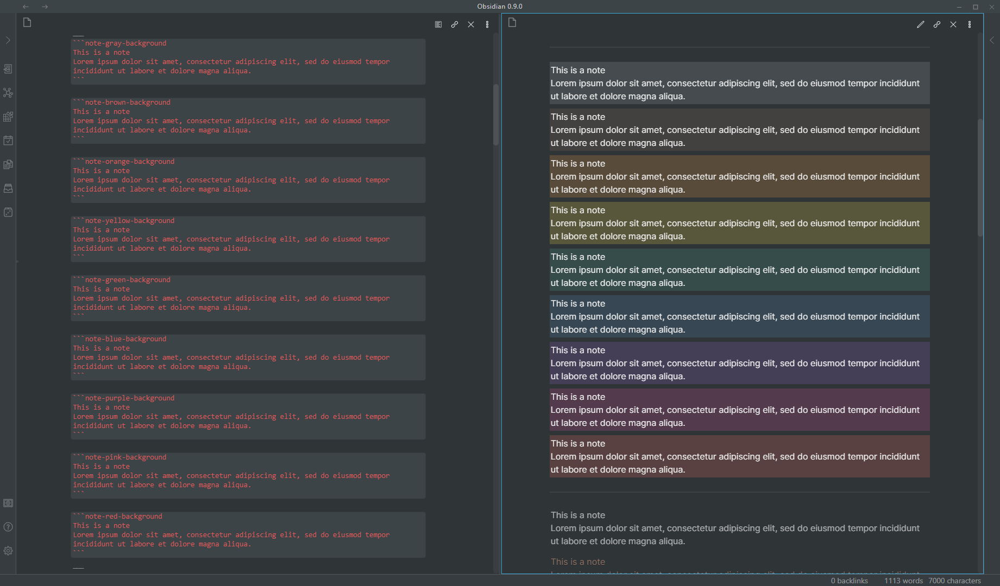
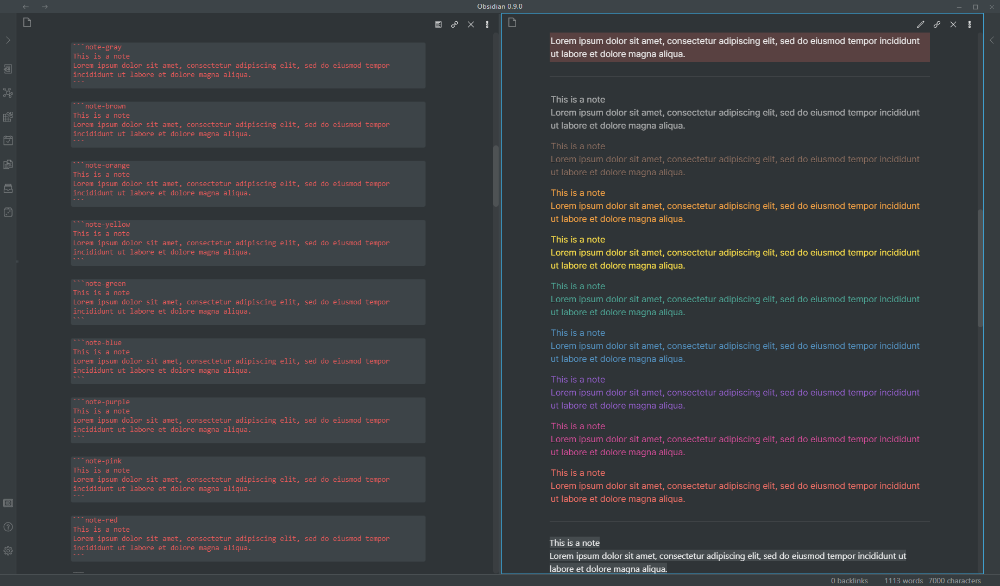
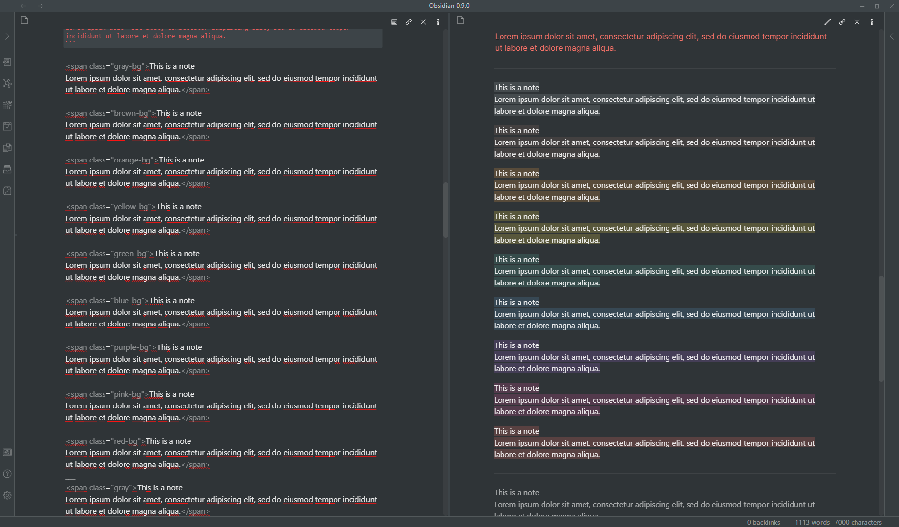
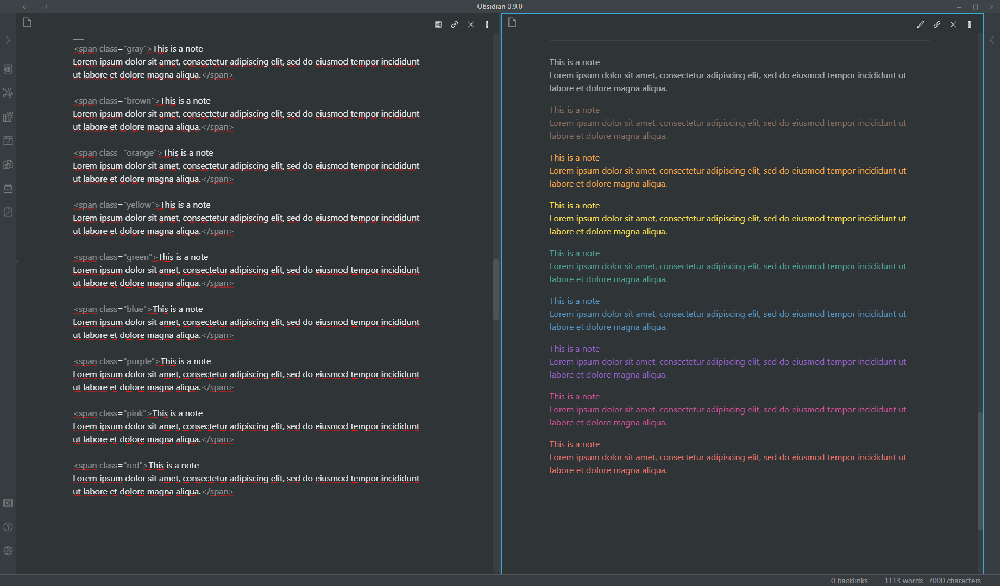
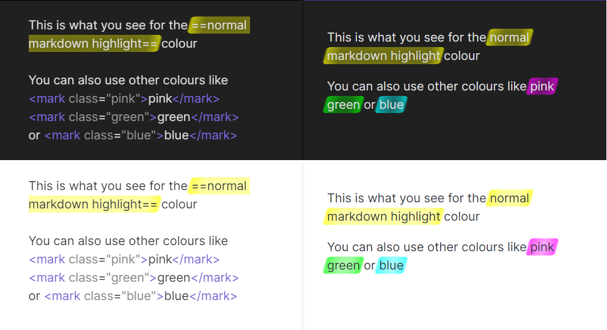
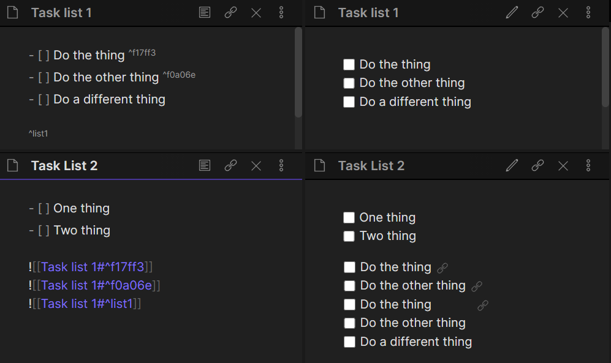
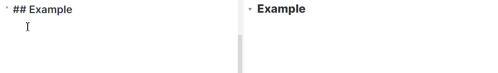
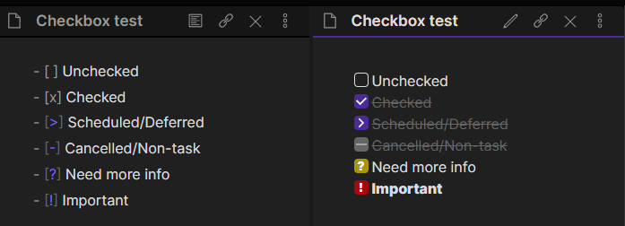

# obsidian-snippets
This is a collection of random snippets I've made. Hopefully it will grow over time.

# Table of Contents
- [Notation Colour Blocks](#notation-colour-blocks)
- [Realistic Highlights](#realistic-highlights)
- [Inline Block Embeds](#inline-block-embeds)
- [Clutter-Free Headings](#clutter-free-headings)
- [Clutter-Free Formatting](#clutter-free-formatting)
- [Checkboxes](#checkboxes)

---

## Notation Colour Blocks
<https://github.com/deathau/obsidian-snippets/blob/main/notation-colour-blocks.css>

A bunch of different coloured blocks, inspired by the block colours offered by Notion.

---

## Realistic Highlights
<https://github.com/deathau/obsidian-snippets/blob/main/realistic-highlight.css>

A fancy-looking highlight that looks like it was made with a highlighter pen

---

## Inline Block Embeds
<https://github.com/deathau/obsidian-snippets/blob/main/inline-block-embeds.css>

Inline-ish block embeds, which I mostly use for adding some block-embedded tasks to the end of a task list

---

## Clutter-Free Headings
<https://github.com/deathau/obsidian-snippets/blob/main/clutter-free-headings.css>

WYSIWYG-ish headings which line up headings, show the formatting markers when editing
and replace them with a muted "H1", "H2" etc when not the active line

---

## Clutter-Free Formatting
<https://github.com/deathau/obsidian-snippets/blob/main/clutter-free-formatting.css>

Formatting which is reduced and hides when not on the active line.
It still leaves the space though, so as to prevent weirdness with cursor movement and selections.

---

## Checkboxes
<https://github.com/deathau/obsidian-snippets/blob/main/checkbox.css>

Checkboxes with different statuses (requires Obsidian 0.12.0+)

---
